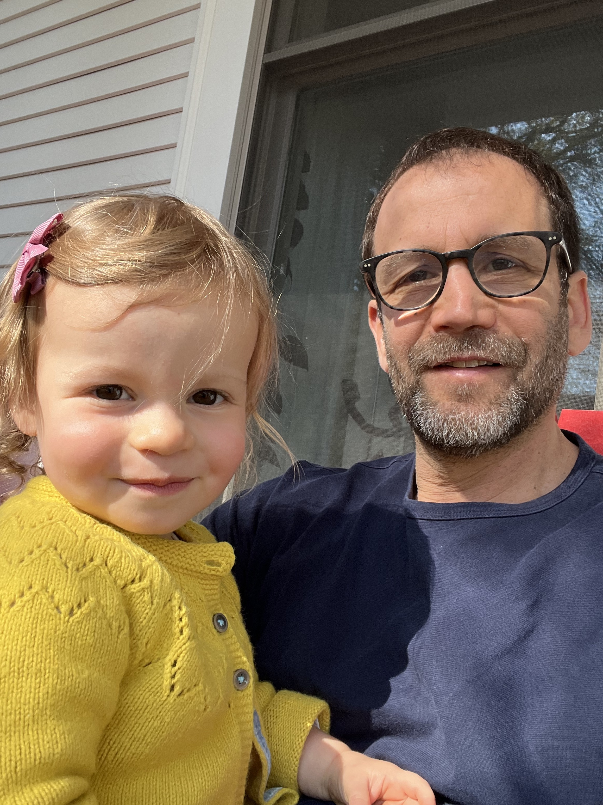

# Jonathan S. Schildcrout, Ph.D.

Professor, Vice Chair of Research \ 
Department of Biostatistics \
Vanderbilt University Medical Center \
2525 West End Ave \
Suite 1100 (mail) \
Suite 1130, Room 1138 (office) \
Nashville, TN 37203 \ 
615.343.5432 \

## Methodological Research Interests

Most of my methodological research is targeted towards longitudinal data studies, epidemiological study designs, and their intersection. 
I have developed and researched semi-parametric and parametric analysis procedures for longitudinal regression modeling. This includes 
models for continuous, binary and ordinal response settings. One of the coolest things to me about longitudinal or repeated measures 
data is that we as analysts are able to consider distinct sources response and particularly exposure variation. As opposed to scalar 
response settings where all response and exposure variability emanates from subject-to-subject heterogeneity, in longitudinal and 
correlated data settings, variability arises from repeated measures within subjects in addition to variability between subjects. The 
extent of between versus within subject variability has a major impact on both on interpretation of model parameters as well as on the 
operating characteristics of the associated estimators. While I believe different models and estimation procedures are useful in different 
scenarios, my methods research for categorical data has tended to focus on marginal model estimation and inference.

Over the past decade, I have been particularly interested in epidemiological study designs for longitudinal data. These designs are 
extensions of the case-control design for scalar, binary response data, to various longitudinal and cluster-correlated response 
distributions. The designs are often retrospective, and are highly cost and resource efficient.

## Collaborative Research Interests

Health services research, diabetes and obesity prevention interventions, pharamcogenetics, resource preserving genetic testing programs 
for indvidualized medicine, epidemiology, predictive modeling and evaluation of predictive models, topics in pain and anesthesiology research.

## Teaching

Bios 7346: Advanced Regression Analysis II (Spring 2013-2021)\
Bios 7330: Regression Modeling Strategies (Spring 2023-2025)

